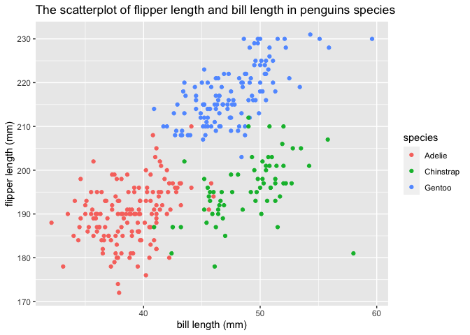

p8105\_hw1\_wb2366
================

``` r
library(tidyverse)
```

    ## ── Attaching packages ─────────────────────────────────────── tidyverse 1.3.1 ──

    ## ✓ ggplot2 3.3.5     ✓ purrr   0.3.4
    ## ✓ tibble  3.1.4     ✓ dplyr   1.0.7
    ## ✓ tidyr   1.1.3     ✓ stringr 1.4.0
    ## ✓ readr   2.0.1     ✓ forcats 0.5.1

    ## ── Conflicts ────────────────────────────────────────── tidyverse_conflicts() ──
    ## x dplyr::filter() masks stats::filter()
    ## x dplyr::lag()    masks stats::lag()

## Problem1

-   Create a data frame comprised of:
    -   a random sample of size 10 from a standard Normal distribution
    -   a logical vector indicating whether elements of the sample are
        greater than 0
    -   a character vector of length 10
    -   a factor vector of length 10, with 3 different factor “levels”

``` r
example_df = tibble(
  vec_df = rnorm(10),
  vec_logical = vec_df > 0,
  vec_char = c("a", "b", "c", "d", "e", "f", "g", "h", "i", "j"),
  vec_factor = factor(c("mid", "low", "high", "mid", "low", "mid", "low", "high", "high", "low"))
)
```

**Try to take the mean of each variable in your dataframe. What works
and what doesn’t?**

``` r
mean_vec_df = mean(pull(example_df, vec_df))
mean_vec_logical = mean(pull(example_df, vec_logical))
mean_vec_char = mean(pull(example_df, vec_char))
```

    ## Warning in mean.default(pull(example_df, vec_char)): argument is not numeric or
    ## logical: returning NA

``` r
mean_vec_factor = mean(pull(example_df, vec_factor))
```

    ## Warning in mean.default(pull(example_df, vec_factor)): argument is not numeric
    ## or logical: returning NA

**Answer:** According to the result, the number and logical vector could
be taken the mean while the character and factor vector couldn’t be
taken the mean

**Write a code chunk that applies the as.numeric function to the
logical, character, and factor variables (please show this chunk but not
the output). What happens, and why? Does this help explain what happens
when you try to take the mean?**

``` r
con_mean_vec_logical = mean(as.numeric(pull(example_df, vec_logical)))
con_mean_vec_char = mean(as.numeric(pull(example_df, vec_char)))
```

    ## Warning in mean(as.numeric(pull(example_df, vec_char))): NAs introduced by
    ## coercion

``` r
con_mean_vec_factor = mean(as.numeric(pull(example_df, vec_factor)))
```

**Answer:** After converting variables to numeric, the logical vector
and factor vector could be taken the mean in that they could be
converted to “0”,“1” or “1”, “2”, “3” by ranking. However, we still fail
to take the mean of the character vector in that character vector
couldn’t be converted in to numeric which is still N/A.

## Problem2

This chunk is used for loading penguins dataset

``` r
data("penguins", package = "palmerpenguins")
```

**The data in this dataset, including names / values of important
variables**

**Answer:** Species is a factor variable, which has species Adelie,
Chinstrap, Gentoo.

Island is a factor variable, which has Biscoe, Dream, Torgersen islands.

Bill length (mm) is a numeric variable. The mean of bill length (mm) is
43.92. The median of Bill length (mm) is 44.45. Values for bill length
range from 32.1, 59.6.

Bill depth (mm) is a numeric variable. The mean of bill depth (mm) is
17.15. The median of bill depth(mm) is 17.3. Values for bill depth range
from 13.1, 21.5.

Body mass (g) is a integer variable. The mean of Body mass (g) is
4201.75. The median of Body mass (g) is 4050 Values for bill depth range
from 2700, 6300 .

Flipper length (mm) is a integer variable. The mean of flipper length
(mm) is 200.92. The median of Flipper length (mm) is 197 Values for
flipper length range from 172, 231 .

Sex is a factor variable, which has female, male categories.

Year is a integer variable. The range for the years variable is from
2007, 2009.

**The size of the dataset (using nrow and ncol)**

**Answer:** row= 344, col = 8

**The mean flipper length**

**Answer:** mean of flipper length = 200.9152047

**Make a scatterplot of flipper\_length\_mm (y) vs bill\_length\_mm
(x)**

``` r
library(ggplot2)
ggplot(data = penguins, aes(x = bill_length_mm, y = flipper_length_mm)) + geom_point()
```

    ## Warning: Removed 2 rows containing missing values (geom_point).

<!-- -->
